# Medtronic packet structure

Below we've documented the structure of the various packets in the Medtronic pump history, matching the fields and record types to our [data model](http://developer.tidepool.io/data-model). Unknown bits are designated with `??`.

## MiniMed 5/7 series Message Envelope
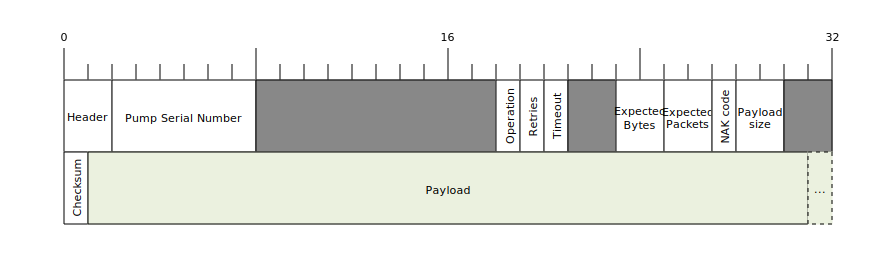

| Field     | Bytes | Data Type  |   Comments   |
|-----------|:-----:|:----------:|--------------|
| Header    | 2     | Bytes      | `0x5101`     |
| Pump Serial Number | 6     | String     | ASCII numbers |
| Padding   | 10    | Bytes      | Null Padded  |
| Operation | 1     | Byte       | *See table below* |
| Retries   | 1     | Byte       | (Number of Retries << 4) + 1 |
| Timeout   | 1     | Byte       | Timeout in seconds |
| Padding   | 2     | Bytes      | Null Padded  |
| Expected Bytes | 2     | UInt16LE   | Expected number of bytes to be returned (0 if not expecting a multi-packet response) |
| Expected Packets | 2     | UInt16LE   | Expected number of packets to be returned + 4096 (0 if not expecting a multi-packet response) |
| NAK Code  | 1     | Byte       | Passthrough NAK Code *See table below*  |
| Payload Size | 2     | UInt16LE   | Size of the Payload + 4 (the header of the inner message) |
| Padding   | 2     | Bytes      | Null Padded  |
| Checksum  | 1     | UInt8      | Sum of the *entire* message, not including the **Checksum** byte itself  |
| Payload   | Variable | Bytes      | Size specified by **Payload Size** |

#### Operation
| Value     | Operation                  |
|-----------|----------------------------|
| `0x10`    |  OPEN_CONNECTION           |
| `0x11`    |  CLOSE_CONNECTION          |
| `0x12`    |  SEND_MESSAGE              |

#### Passthrough NAK Code
| Value     | Meaning                    |
|-----------|----------------------------|
| `0x0`     |  No Error                  |
| `0x01`    |  Multipacket not supported |
| `0x02`    |  General command parameter error |
| `0x03`    |  Unsupported or undefined command |
| `0x04`    |  Retries exceeded          |
| `0x05`    |  Command timed out         |
| `0xFE`    |  Passthrough checksum error |
| `0xFF`    |  Passthrough protocol error (invalid header, checksum or other general passthrough error) |

## Basals

### Scheduled basal
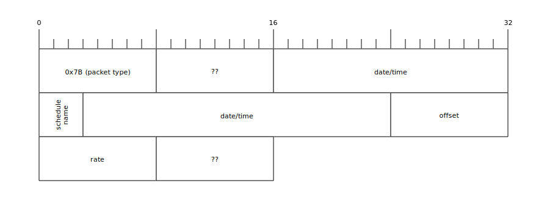

### Temp basal
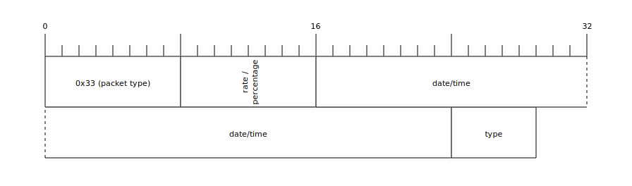

#### Temp basal duration
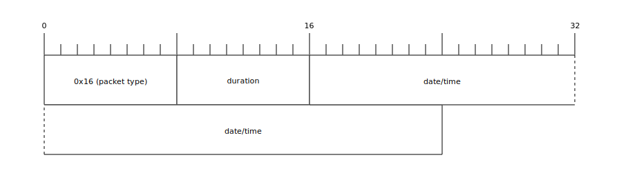

## Boluses

### Manual bolus
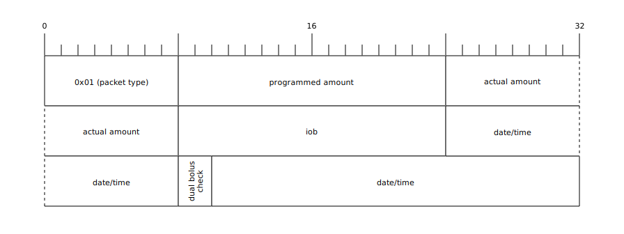

### Wizard bolus

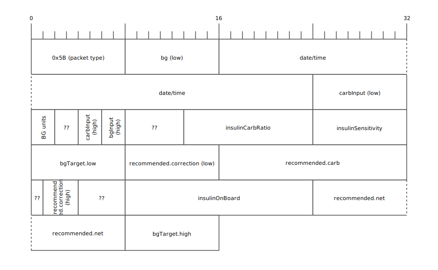

## Device events

### Pump alarm
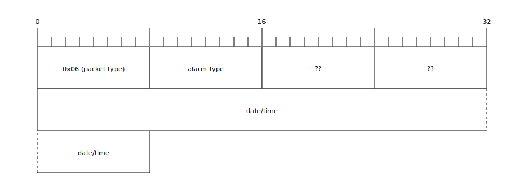

### Suspend
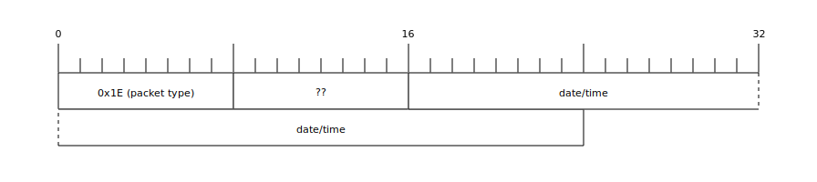

### Prime

### Rewind
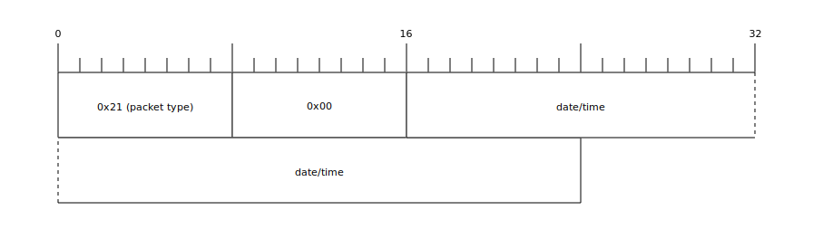

## SMBG

### Manual
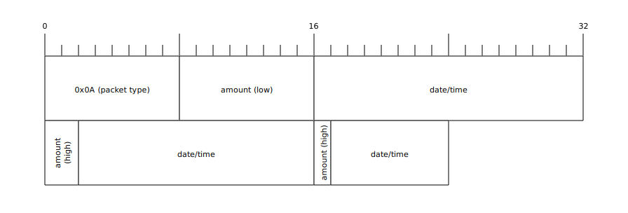

### Linked
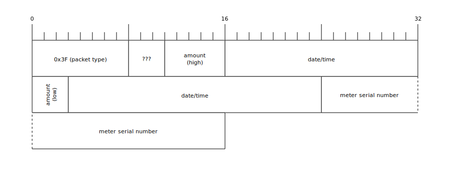

## Device settings

### Basal schedules

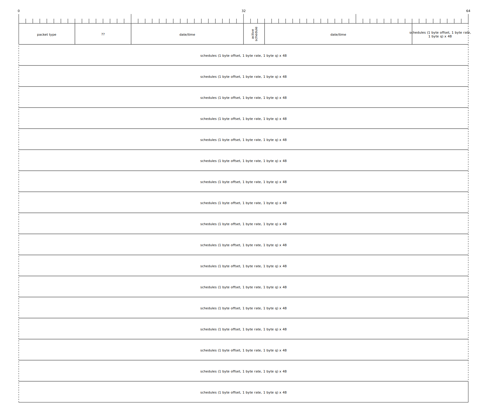

### Wizard settings
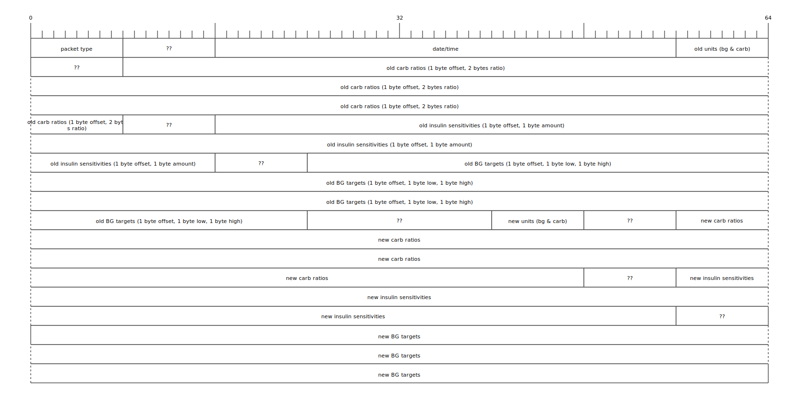
