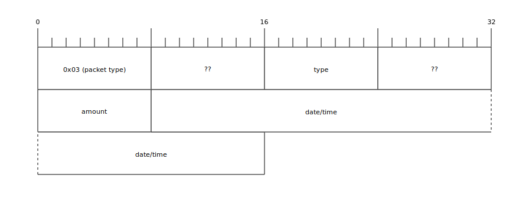

## Basals

### Scheduled basal

### Temp basal

#### Temp basal duration

## Boluses

### Manual bolus

### Wizard bolus

## Device events

### Pump alarm

### Suspend

### Prime

### Rewind

## SMBG

### Manual

### Linked

## Device settings

### Basal schedules

### Wizard settings

